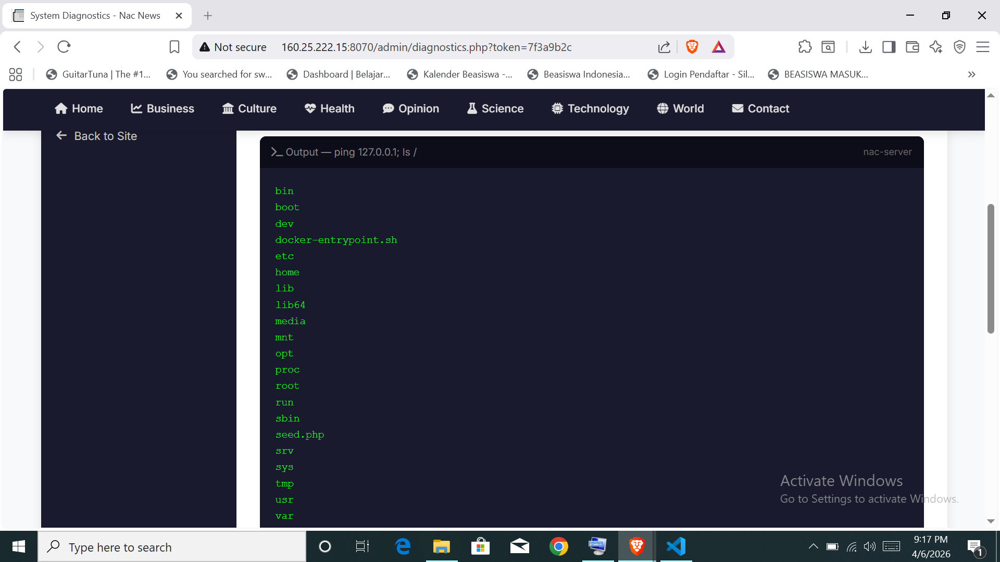
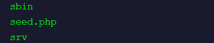
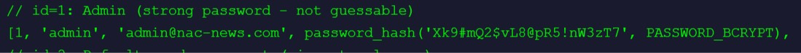
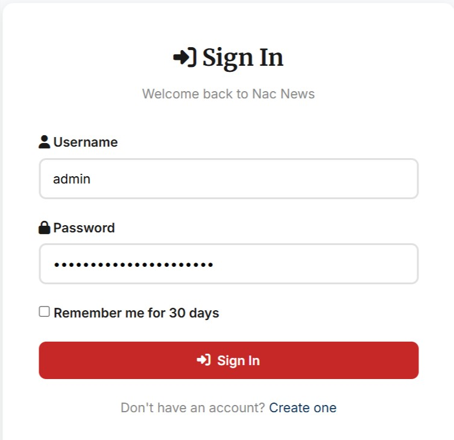
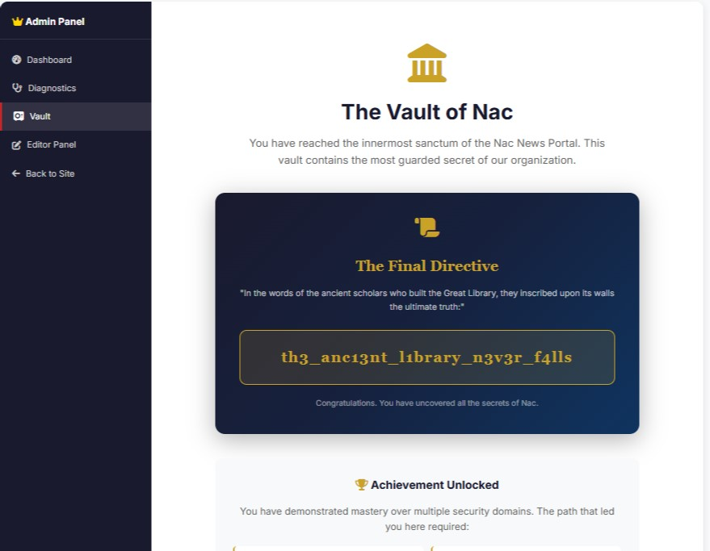
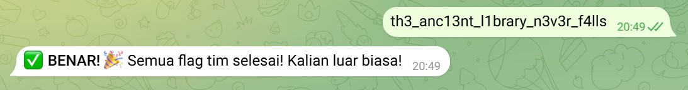
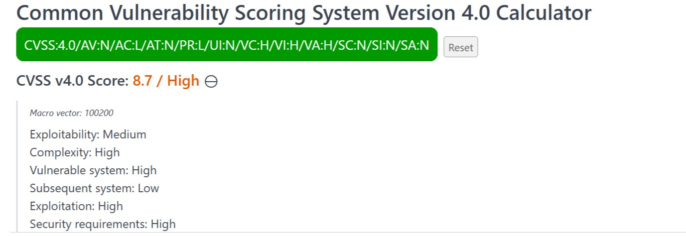

# FLAG [11]: Top-Secret Project Codename

### Description
Apa rahasia terakhir yang ditemukan di halaman /admin/vault.php setelah berhasil melakukan eskalasi privilege ke admin?

### Hint
💡 Hint: Cookie Forgery, Broken Acces Control

### Analysis
Setelah sebelumnya memperoleh akses ke halaman admin diagnostics melalui token yang didapat dari '../../../../var/log/nac/admin_actions.log' (Flag 9), kami melanjutkan eksplorasi terhadap fitur tersebut. Halaman /admin/diagnostics.php menyediakan fungsi network diagnostic yang memungkinkan eksekusi perintah sistem secara langsung dari input pengguna.

Meskipun terdapat klaim pembatasan karakter berbahaya, implementasi filtering ternyata tidak efektif. Hal ini membuka peluang terjadinya Command Injection, yang memungkinkan kami menjalankan perintah sistem di sisi server.

Dengan memanfaatkan celah tersebut, kami mulai melakukan enumerasi direktori untuk mencari file sensitif yang mungkin menyimpan informasi penting. Pendekatan ini juga sekaligus bertujuan menemukan flag sebelumnya (Flag 10).

### Solution
**1. Eksploitasi Command Injection pada Diagnostics Tool**

Kami menyadari bahwa input pada field Target Host/IP dapat dimanipulasi dengan menambahkan perintah tambahan menggunakan separator (;).

```
127.0.0.1; ls /
```

Hasilnya, server mengeksekusi perintah ls dan menampilkan daftar direktori root sistem.



**2. Identifikasi File Sensitif (seed.php)**

Dari hasil enumerasi, kami menemukan file mencurigakan bernama:

```
seed.php
```



File ini tampak seperti file inisialisasi data (seeding) yang biasanya digunakan developer untuk mengisi database awal.

**3. Ekstraksi Informasi Sensitif**

Kami kemudian membaca isi file tersebut menggunakan:

```
127.0.0.1; cat /seed.php
```

Hasilnya menampilkan berbagai kredensial user, termasuk akun admin beserta password-nya dalam bentuk plaintext sebelum hashing.

Di dalam file tersebut ditemukan:
* Username : admin
* Password : 'Xk9#mQ2$vL8@pR5!nW3zT7'
  


**4. Login sebagai Admin**

Dengan kredensial yang diperoleh, kami mengakses halaman login:



Setelah memasukkan username dan password admin, kami berhasil mendapatkan akses penuh ke panel admin.

**5. Akses /admin/vault.php**

Setelah berhasil login sebagai admin, kami mendapatkan akses ke fitur atau halaman vault yang sebelumnya dibatasi. Dari sinilah flag berhasil diperoleh.



**🚩 Bukti Flag Benar:**



---

### Vulnerability Assessment
* **Vulnerability:** 
** Command Injection, Sensitive Information Exposure, & Improper Access Control
* **Severity:** High
* **CVSS v4.0 Score:** **8.7 (High)**
* **CVSS Vector:** `CVSS:4.0/AV:N/AC:L/AT:N/PR:L/UI:N/VC:H/VI:H/VA:H/SC:N/SI:N/SA:N`
  


### Saran Rekomendasi Mitigasi
1. **Validasi Input Secara Ketat (Input Sanitization)**
Jangan pernah mengeksekusi input pengguna secara langsung ke dalam perintah sistem. Gunakan whitelist untuk memastikan hanya input valid (IP/domain) yang diproses.
2. **Amankan file sensitif** 
File seperti seed.php tidak boleh berada di environment produksi. Gunakan environment terpisah dan pastikan file development tidak terdeploy.
3. **Enkripsi & Proteksi Kredensial**
Jangan menyimpan password dalam bentuk plaintext di dalam kode. Gunakan environment variables atau secret management system.
4. **Implementasi Monitoring & Logging**
Deteksi aktivitas abnormal seperti eksekusi command tidak biasa (ls, cat, dll) dari aplikasi web.
