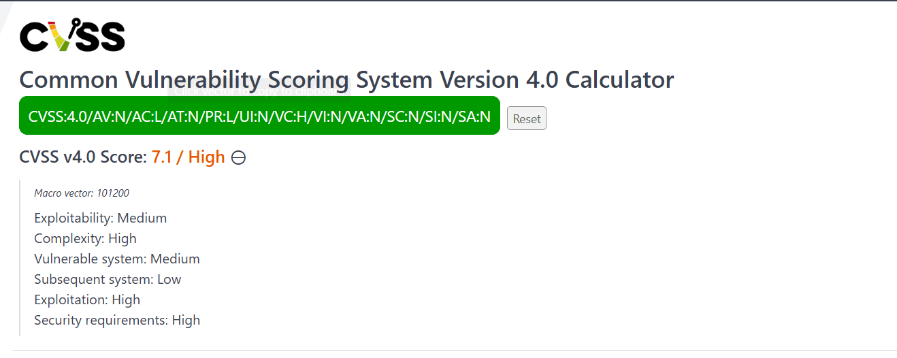

# FLAG [3]: Hidden Service Account Recovery Email

### Description
Apa recovery email dari service account yang tersembunyi di website ini?

### Hint
💡 Hint: IDOR, Out of box

### Analysis
Untuk menyelesaikan tantangan ini, kami memutuskan untuk melakukan *Vulnerability Chaining* (menggabungkan dua celah keamanan). Daripada menebak angka ID secara acak (*blind fuzzing*), kami memanfaatkan celah SQL Injection yang sudah kami temukan sebelumnya pada `search.php?q=` untuk mengekstrak informasi dari tabel `users` di database.

Dari hasil ekstraksi data tersebut, kami menemukan sebuah *Service Account* dengan *username* `sysbot` yang terdaftar pada ID `13`. Meskipun *link* menuju profil `sysbot` ini disembunyikan dari antarmuka web publik, kami menyadari bahwa fitur profil pengguna di *endpoint* `profile.php?id=` rentan terhadap *Insecure Direct Object Reference* (IDOR). Dengan memasukkan parameter `id=13` secara langsung ke URL, kami berhasil mem-*bypass* batasan UI dan membongkar profil rahasia tersebut untuk mendapatkan *Recovery Email*-nya.

### Solution

**1. Scanning Data Menggunakan SQLMap**
Menggunakan titik injeksi dari Flag 2, kami menjalankan `sqlmap` dengan optimasi *threads* dan *keep-alive* untuk mengekstrak kolom-kolom spesifik dari tabel `users` (`id, username, email, password`).
```bash
sqlmap -u "[http://160.25.222.15:8070/search.php?q=test](http://160.25.222.15:8070/search.php?q=test)" \
--cookie="PHPSESSID=a64b2b04ca168600434f5d7f48a7cdb5" \
-D nac_news -T users -C id,username,email,password \
--dump --threads=10 --keep-alive -o --batch
```


**2. Identifikasi Target ID**
Proses scanning mendapatkan database memunculkan 17 entri pengguna. Pada baris dengan **ID 13**, kami menemukan akun target yang dicari, yaitu `sysbot` (System Bot), lengkap dengan alamat *email* utamanya dan *hash password* Bcrypt.


**3. Eksploitasi IDOR di Browser**
Berbekal informasi ID valid dari database, kami kembali ke *browser* dan memanipulasi parameter URL profil secara manual menjadi target ID yang telah kami temukan:
```text
http://160.25.222.15:8070/profile.php?id=13
```

**4. Ekstraksi Recovery Email**
Eksploitasi IDOR berhasil. Server menampilkan halaman profil rahasia bernama **System Bot**. Di bagian pojok kanan bawah profil tersebut, tertulis dengan jelas informasi sensitif yang kami cari.


**Bukti Flag Benar:**
`sysbot@internal.nac.local`


---

### Vulnerability Assessment
* **Vulnerability:** Insecure Direct Object Reference (IDOR) / Broken Access Control
* **Severity:** High (Kerahasiaan akun internal terekspos)
* **CVSS v4.0 Score:** **7.1 (High)**
* **CVSS Vector:** `CVSS:4.0/AV:N/AC:L/AT:N/PR:L/UI:N/VC:H/VI:N/VA:N/SC:N/SI:N/SA:N`
.

### Saran Rekomendasi Mitigasi
1. Implementasi Authorization Check (Access Control)
   
   Jangan hanya mengandalkan status login (Authentication). Setiap kali aplikasi memproses request ke profile.php?id=X, pastikan ada logika tambahan di level           backend yang mengecek apakah user yang meminta halaman tersebut benar-benar memiliki wewenang (privilege) untuk melihat data dari ID target tersebut.
   
3. Gunakan UUID/GUID (Universally Unique Identifier)
   
    Gantilah format ID yang berurutan/sekuensial (seperti 1, 2, atau 13) pada parameter URL dengan string acak yang panjang, seperti UUID (contoh: 123e4567-e89b-        12d3-a456-426614174000). Ini akan mencegah penyerang melakukan enumerasi (fuzzing) atau menebak ID profil pengguna lain.
   
5. Pemisahan Tampilan Akun Sistem
   
   Terapkan perlindungan ekstra di tingkat database atau di dalam kode aplikasi (seperti filter kondisi) yang secara eksplisit memblokir segala bentuk akses publik     ke entitas sistem internal seperti sysbot. Akun-akun berlevel sistem tidak boleh di-render sama sekali oleh antarmuka web, terlepas dari ID apa pun yang             dimasukkan oleh pengguna.
